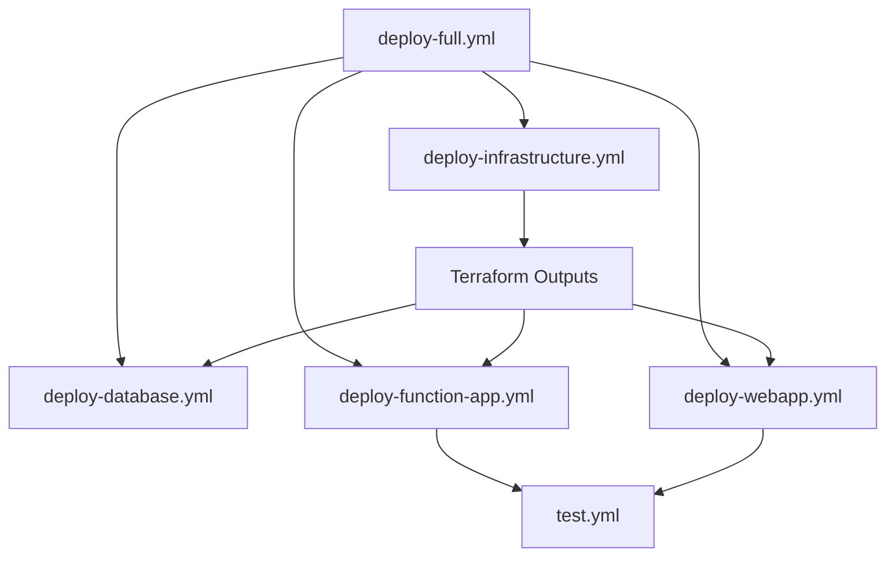

# GitHub Actions Workflows

This directory contains CI/CD workflows for the Azure Pricing History project.

## Workflows Overview

### 🚀 Deployment Workflows

#### 1. **[deploy-full.yml](deploy-full.yml)** - Complete Solution Deployment
Deploys the entire solution including infrastructure, database, Function App, and Web App.

**Trigger:** Manual (`workflow_dispatch`)

**Inputs:**
- `environment`: Target environment (dev/test/prod)
- `skip_infrastructure`: Skip Terraform deployment
- `skip_database`: Skip database schema deployment

**Jobs:**
1. Deploy Infrastructure (Terraform)
2. Deploy Database Schema
3. Grant Managed Identity Permissions
4. Deploy Function App
5. Deploy Web App
6. Verify Deployment

**Usage:**
```bash
# Go to Actions → Deploy Full Solution → Run workflow
# Select environment and options
```

#### 2. **[deploy-infrastructure.yml](deploy-infrastructure.yml)** - Infrastructure Only
Manages Azure infrastructure using Terraform.

**Triggers:**
- Manual (`workflow_dispatch`)
- Pull requests affecting `infra/terraform/**`

**Inputs:**
- `environment`: Target environment (dev/test/prod)
- `action`: Terraform action (plan/apply/destroy)

**Features:**
- Automated Terraform format check
- Plan output on pull requests
- Artifact upload for plans

**Usage:**
```bash
# Plan changes
gh workflow run deploy-infrastructure.yml -f environment=dev -f action=plan

# Apply changes
gh workflow run deploy-infrastructure.yml -f environment=dev -f action=apply

# Destroy infrastructure
gh workflow run deploy-infrastructure.yml -f environment=prod -f action=destroy
```

#### 3. **[deploy-function-app.yml](deploy-function-app.yml)** - Function App Deployment
Deploys only the Azure Function App.

**Triggers:**
- Manual (`workflow_dispatch`)
- Push to `main` affecting `src/functions-python/**` or `src/shared/**`

**Features:**
- Runs unit tests before deployment
- Code coverage reporting
- Deployment verification

**Usage:**
```bash
# Manual deployment
gh workflow run deploy-function-app.yml -f environment=prod

# Automatic on push to main
git push origin main
```

#### 4. **[deploy-webapp.yml](deploy-webapp.yml)** - Web App Deployment
Deploys only the Flask web application.

**Triggers:**
- Manual (`workflow_dispatch`)
- Push to `main` affecting `src/webapp/**` or `src/shared/**`

**Features:**
- Runs unit tests before deployment
- Creates deployment package
- Health check verification

**Usage:**
```bash
# Manual deployment
gh workflow run deploy-webapp.yml -f environment=prod
```

#### 5. **[deploy-database.yml](deploy-database.yml)** - Database Schema Deployment
Deploys SQL schema and grants permissions.

**Triggers:**
- Manual (`workflow_dispatch`)
- Push to `main` affecting SQL files in `scripts/`

**Inputs:**
- `environment`: Target environment (dev/test/prod)
- `grant_permissions`: Grant managed identity permissions (default: true)

**Usage:**
```bash
# Deploy schema with permissions
gh workflow run deploy-database.yml -f environment=dev -f grant_permissions=true
```

### 🧪 Testing Workflows

#### 6. **[test.yml](test.yml)** - Continuous Integration
Runs comprehensive tests on every push and pull request.

**Triggers:**
- Push to `main` or `develop`
- Pull requests to `main` or `develop`
- Manual (`workflow_dispatch`)

**Jobs:**
- **Lint:** Black, Flake8, Pylint, MyPy
- **Unit Tests:** Pytest with coverage (Python 3.11 & 3.12)
- **Security Scan:** Safety, Bandit
- **Terraform Validate:** Format and validation checks

**Features:**
- Test results published on PRs
- Code coverage reports to Codecov
- Security vulnerability scanning
- Multi-version Python testing

## Required Secrets

Configure these secrets in GitHub Settings → Secrets and variables → Actions:

### Azure Authentication
- `AZURE_CLIENT_ID`: Service Principal client ID
- `AZURE_TENANT_ID`: Azure AD tenant ID
- `AZURE_SUBSCRIPTION_ID`: Azure subscription ID

### Optional
- `CODECOV_TOKEN`: For code coverage reporting

## Environment Configuration

Create environments in GitHub Settings → Environments:
- **dev** - Development environment
- **test** - Testing environment
- **prod** - Production environment (with approvals)

Each environment should have:
- Azure authentication secrets
- Environment-specific variables
- Protection rules (especially for prod)

## Workflow Permissions

Workflows use OpenID Connect (OIDC) for passwordless Azure authentication:

```yaml
permissions:
  id-token: write      # Required for OIDC
  contents: read       # Read repository
  pull-requests: write # Comment on PRs
```

## Common Usage Patterns

### Deploy Everything to Dev
```bash
gh workflow run deploy-full.yml \
  -f environment=dev \
  -f skip_infrastructure=false \
  -f skip_database=false
```

### Update Only Function App in Production
```bash
gh workflow run deploy-function-app.yml -f environment=prod
```

### Infrastructure Changes
```bash
# 1. Create PR with Terraform changes
# 2. Review plan in PR comments
# 3. Merge PR
# 4. Manually apply changes
gh workflow run deploy-infrastructure.yml -f environment=prod -f action=apply
```

### Database Schema Update
```bash
# 1. Update deploy_complete.sql
# 2. Deploy to dev first
gh workflow run deploy-database.yml -f environment=dev

# 3. Test, then deploy to prod
gh workflow run deploy-database.yml -f environment=prod
```

## Workflow Dependencies



## Best Practices

1. **Always test in dev first**
   ```bash
   gh workflow run deploy-full.yml -f environment=dev
   ```

2. **Use Terraform plan before apply**
   ```bash
   gh workflow run deploy-infrastructure.yml -f environment=prod -f action=plan
   ```

3. **Monitor deployments**
   - Check GitHub Actions logs
   - Review Azure Portal
   - Verify Application Insights

4. **Review PR comments**
   - Terraform plans appear automatically on PRs
   - Review changes before merging

5. **Use environment protection**
   - Require approvals for prod
   - Add deployment gates
   - Configure reviewers

## Troubleshooting

### Authentication Failures
```bash
# Verify service principal
az ad sp show --id $AZURE_CLIENT_ID

# Check RBAC assignments
az role assignment list --assignee $AZURE_CLIENT_ID
```

### Terraform State Issues
```bash
# Manually init and check state
cd infra/terraform
terraform init
terraform state list
```

### Function/Web App Deployment Failures
```bash
# Check app status
az functionapp show --name func-pricing-dev-gwc --resource-group rg-pricing-dev-gwc
az webapp show --name webapp-pricing-dev-gwc --resource-group rg-pricing-dev-gwc

# View logs
az functionapp log tail --name func-pricing-dev-gwc --resource-group rg-pricing-dev-gwc
```

### Database Permission Issues
```bash
# Re-run permission grants
gh workflow run deploy-database.yml -f environment=dev -f grant_permissions=true
```

## Monitoring

View workflow runs:
```bash
# List recent runs
gh run list

# View specific run
gh run view <run-id>

# Watch live run
gh run watch <run-id>
```

## Additional Resources

- [GitHub Actions Documentation](https://docs.github.com/en/actions)
- [Azure Login Action](https://github.com/azure/login)
- [Terraform GitHub Actions](https://developer.hashicorp.com/terraform/tutorials/automation/github-actions)
- [Project Deployment Guide](../../DEPLOYMENT.md)
